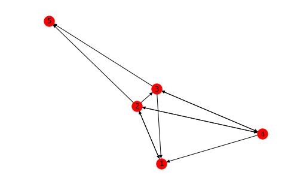
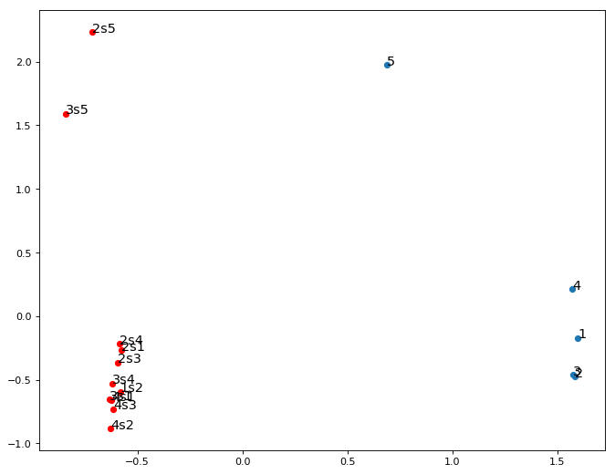
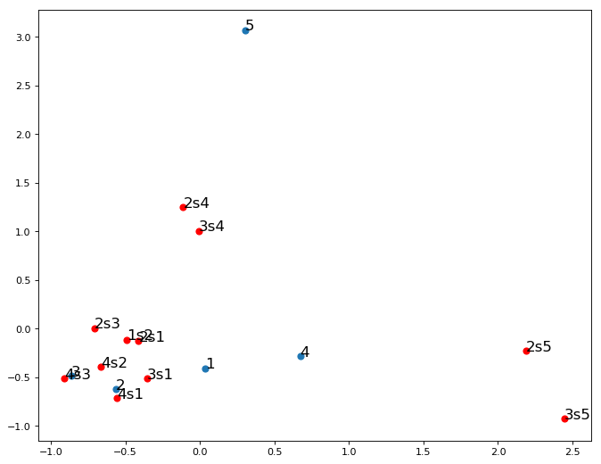

# Project: Natural knowledge representation
## **Intro**
>
* The goal of this project is to build a learning AI agent and to test its abilities to describe an observed physical system using sequences of states during the evolution of the system. It should be able to learn relations and dependencies between physical states, articulating them in form of an artificial language which will be sufficient for formulation of physical laws and description of a system. The agent should be able to answer the question about the system state, its previous states and make the hypothesis about evolution of a system, as well as to single out causal structure concerning the system states. This should simulate the way humans learn about physical laws that govern their environment.
* Since our final goal is the linguistic representation of knowledge, we want to either partially use current NLP techniques to address certain aspects of our research, or to develop new techniques and architecture. The present RNN-based models like Seq2seq can be used to learn to express the sequential patterns of updates of a system states by lingual sequence and hence formulate observed states in terms of language, but they lack both the concept structure (notions) and coherent knowledge about previous states of the system. On the other hand, certain statistically modeled vector representations like GloVe or Word2vec can simulate conceptual representation of the knowledge (through analogies and proximity in certain directions of embedding space), as a form of a concept space, but they lack non-commutative ordering of notions present in formulated thought. Vector representation of  system states based on the co-occurrence of the states of a physical system, could give us deeper insight into the causal structure of the system (e.g.  physical states that appear often in pairs will be closer in embedding space like bigrams in language representation). But similarly to Seq2seq embedding vector spaces lack the knowledge of the previous states of the system so that they have no coherent knowledge of the system evolution. Memory Networks can in a limited way help in approaching the goal of having the ability to refer to the present state of system taking into account the previous ones.
* None of the above described NLP models alone is sufficient to fulfill our task. Therefore we are trying to build a model, either as a combination of previous models or a new one. The model should be able to overcome the mentioned obstacles and be capable of learning facts and laws about physical world and answering the questions about it, in a consistent and coherent way, like a human being.  
* The details of the first stage of this project are given in our paper
[Deep learning based unsupervised concept unification in the embedding space](https://arxiv.org/abs/1906.01873)

## **Details**

> Requirements
* Tensorflow 1.5.0+
* Keras 2.2.2+
* Gensim 3.7.1
* NetworkX 2.1

> Results
* Our learning agent goes through oriented graph several times, each time making sequence of nodes and edges following a path which has certain level of randomness that we ascribe to a present noise. Nodes are denoted by ordinary numbers 1, 2, 3... and edges by their ordering 3s5, 2s5, 2s3... By going through the graph our agent makes sequences of the type 2, 4, 3, 5 etc. This is one level of description of the graph. The other level of description is in terms of edges 2s4, 4s3, 3s5, etc. These two ways of describing should be equivalent. Nevertheless, there are less nodes than edges and the sequences containing the edges are shorter, thereby our descriptions do not have the same measure. We may interpret this as primitive description and meta-description on the level of notions. Edges represent higher-level notions.

* We use Word2Vec algorithm to try to semantically represent our notions which then appear in two distinct embedding distributions.

* After PCA from 10-dimensional embedding space of latent semantic representation of our notions, we obtain two clearly separated distributions. Points 2 and 3 almost coincide since the nodes have almost identical occurrence statistics. On the other edge 5 is different, as well as 2s5 and 3s5. In order to obtain a unified conceptual framework, we align the two distributions using orthogonal Procrustes rotations and reflections. This transformation in unsupervised way minimizes the mutual distance between the two distributions.

* This results in unified conceptual structure, which corresponds to the mental representation of a concept learner. Even though this embedding space is obtained in unsupervised way, it reveals the geometric relation between the two levels of description. One can see similar structures of the form 2, 4, 2s4 and 3, 4, 3s4, or 2, 5, 2s5 and 3, 5, 3s5   in terms of similar triangles. At the same time 3s1 is between 3 and 1 etc.
* We expect to obtain even better results if we apply domain adversarial training to align the two distributions.
* Our approach follows the techniques used for [unsupervised machine translation](https://github.com/facebookresearch/MUSE), but in our case we do not have 1-1 translation which results in more complicated structure which is yet to be understood.
